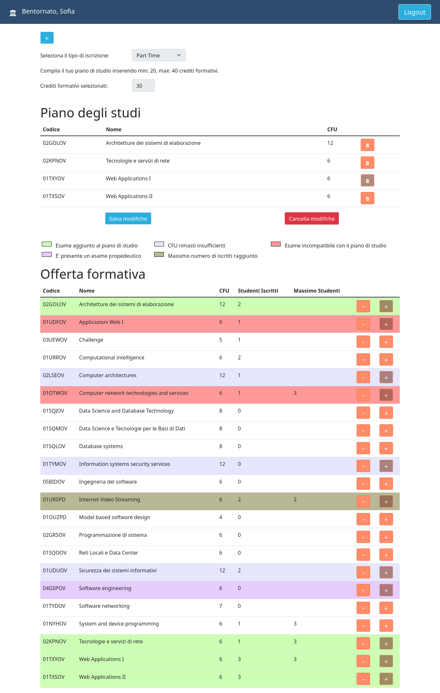

# Exam #1: "Piano degli studi"
## Student: s303393 BELLONI SOFIA 

## React Client Application Routes

- Route `/`: HomePage with the list of all available courses. If the user is logged in, he can add a new study plan or, if already present, edit or delete it.
- Route `path=/login`: Login page.
- Route `path=/edit`: Edit page where the logged user can add or edit his study plan. In the first case, he can choose the type of enrollment (full-time or part-time), while in the second case he can only add or modify study plan's courses.

## API Server

### Courses and study plan management

#### Get all Courses

* HTTP method: `GET`  URL: `/api/courses`
* Description: Get all the courses
* Request body: _None_
* Request query parameter: _None_
* Response: `200 OK` (success) `500` (internal server error)
* Response body: Array of objects, each describing one course:

```
[{
  "code":"02GOLOV",
  "name":" Architetture dei sistemi di elaborazione",
  "cfu":12,
  "student":0,
  "maxStudent":null,
  "prerequisite":null,
  "incompatibility":["02LSEOV"]
 },
 {
  "code":"01UDFOV",
  "name":"Applicazioni Web I",
  "cfu":6,
  "student":1,
  "maxStudent":null,
  "prerequisite":null,
  "incompatibility":["01TXYOV"]
  },
  ...
```

#### Get StudyPlan

* HTTP method: `GET`  URL: `/api/studyplan`
* Description: Get all the courses of the study plan belong to the logged user
* Request body: _None_
* Request query parameter: _None_
* Response: `200 OK` (success) `500` (internal server error)
* Response body: Array of objects, each describing one course of the study plan:

```
[{
  "code":"02GOLOV",
  "name":" Architetture dei sistemi di elaborazione",
  "cfu":12,
  "student":0,
  "maxStudent":null,
  "prerequisite":null,
 },
 {
  "code":"01UDFOV",
  "name":"Applicazioni Web I",
  "cfu":6,
  "student":1,
  "maxStudent":null,
  "prerequisite":null,
  },
  ...
```

#### Delete study plan

* HTTP method: `DELETE`  URL: `/api/studyplan`
* Description: Delete the existing study plan of the logged user
* Request body: _None_
* Response: `200 OK` (success) `503` (internal server error)
* Response body: _None_

#### __Update enrollment__

* HTTP Method: `PUT` URL: `/api/enrollment`
* Description: Update the enrollment value of the logged user (partTime, fullTime or null)
* Request body: value of enrollment

```
{enrollment: "partTime"}
```
* Response: `200 OK` (success) `503` (internal server error) `422` (not found)


#### __Increment enrolled students' number__

* HTTP Method: `PUT` URL: `/api/increment/students`
* Description: Increase enrolled students number
* Request body: _None_
* Response: `200 OK` (success) `503` (internal server error) `422` (not found)

#### __Decrement enrolled students' number__

* HTTP Method: `PUT` URL: `/api/decrement/students`
* Description: Decrease enrolled students number
* Request body: _None_
* Response: `200 OK` (success) `503` (internal server error) `422` (not found)

#### __Add study plan__

* HTTP Method: `POST` URL: `/api/studyplan`
* Description: Adds a new study plan of the logged user
* Request body: array of courses' codes

```
{ courses: studyPlan }
```
* Response: `201 OK` (success) `503` (internal server error) `422` (not found)
* Response body: _None_ 

### User management
#### Login

* HTTP method: `POST`  URL: `/api/sessions`
* Description: authenticate the user who is trying to login
* Request body: credentials of the user who is trying to login

```
{
    "username": "username",
    "password": "password"
}
```
* Response: `200 OK` (success), `500 Internal Server Error` (generic error), `401 Unauthorized User` (login failed)
* Response body: authenticated user

```
{
    "id": 2,
    "username": "sofiabelloni@polito.it", 
    "name": "Sofia",
    "enrollment": "partTime"
}
```

#### Check if user is logged in

* HTTP method: `GET`  URL: `/api/sessions/current`
* Description: check if current user is logged in and get his data
* Request body: _None_
* Response: `200 OK` (success), `500 Internal Server Error` (generic error), `401 Unauthorized User` (user is not logged in)
* Response body: authenticated user

``` JSON
{
    "id": 2,
    "username": "sofiabelloni@polito.it", 
    "name": "Sofia",
    "enrollment": "partTime"
}
```

#### Logout

* HTTP method: `DELETE`  URL: `/api/sessions/current`
* Description: logout current user
* Request body: _None_
* Response: `200 OK` (success), `500 Internal Server Error` (generic error), `401 Unauthorized User` (user is not logged in)
* Response body: _None_

## Database Tables

- Table `exams`: contains `code`, `name`, `cfu`, `student`, `maxStudent`, `prerequisite` of each course.

- Table `incompatibility`: contains `code1`, `code2`, i.e. codes of incompatible courses.

- Table `studyPlan`: contains `id`, `code` where id is from users.id and code is from exams.code
- Table `users`: contains `id`, `email`, `name`, `hash`, `salt`, `enrollment` of each user.


## Main React Components

- `HomePage` (in `HomePageComponents`): represent the home page with the table of all courses (ExamTable). If the user is logged in, it shows also the study plan (if present).
- `CreatePlan` (in `CreatePlanComponents`): represents the edit page where the logged user can add or edit his study plan. 
- `ExamTable` (in `ExamComponents.js`): represent the table showing all courses.
- `PlanTable` (in `StudyPlanComponents.js`): represent the table showing study plan's courses.
- `LoginForm` (in `LoginComponents.js`): represents the form of the login.

## Screenshot



## Users Credentials

| email | password | name | enrollmen |
|-------|----------|------|-----------|
| test@polito.it | password | Test | fullTime |
| sofiabelloni@polito.it | password | Sofia | partTime |
| stefano@gmail.com | password | Stefano | partTime |
| mariorossi@polito.com | password | Mario | NULL | 
| john.doe@gmail.com | password | John | NULL |